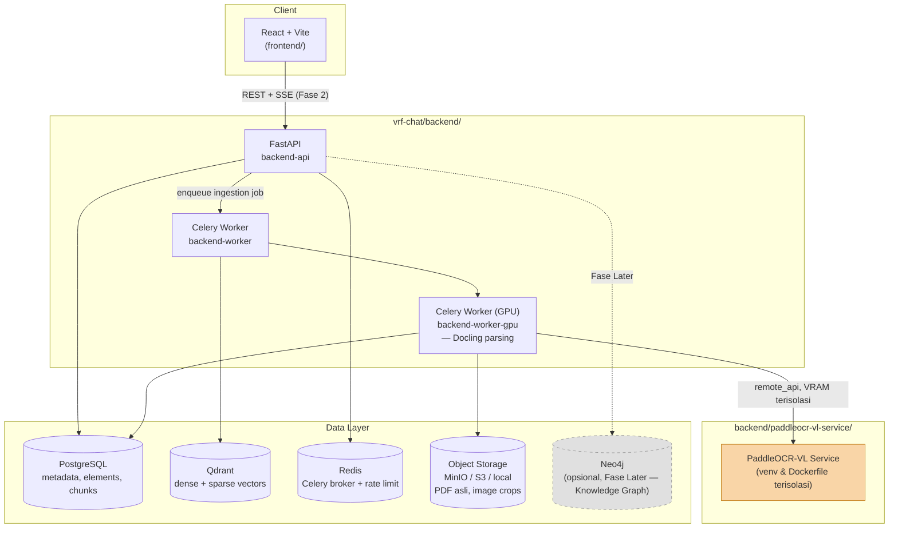
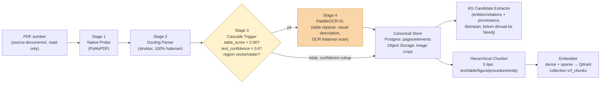
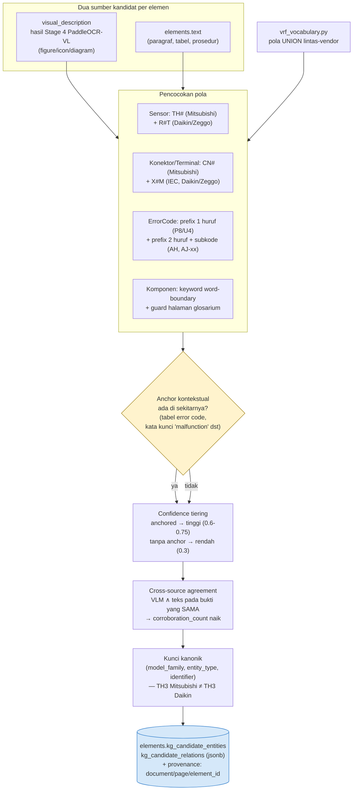
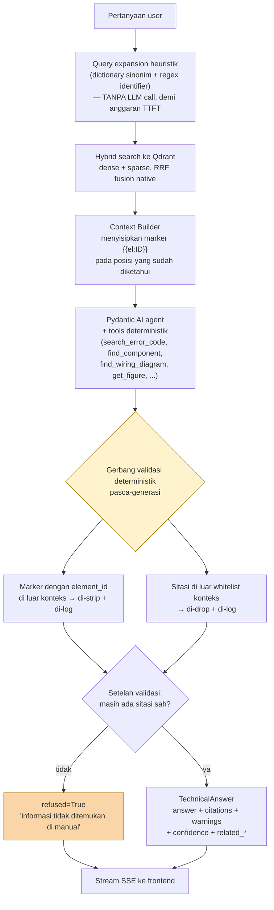
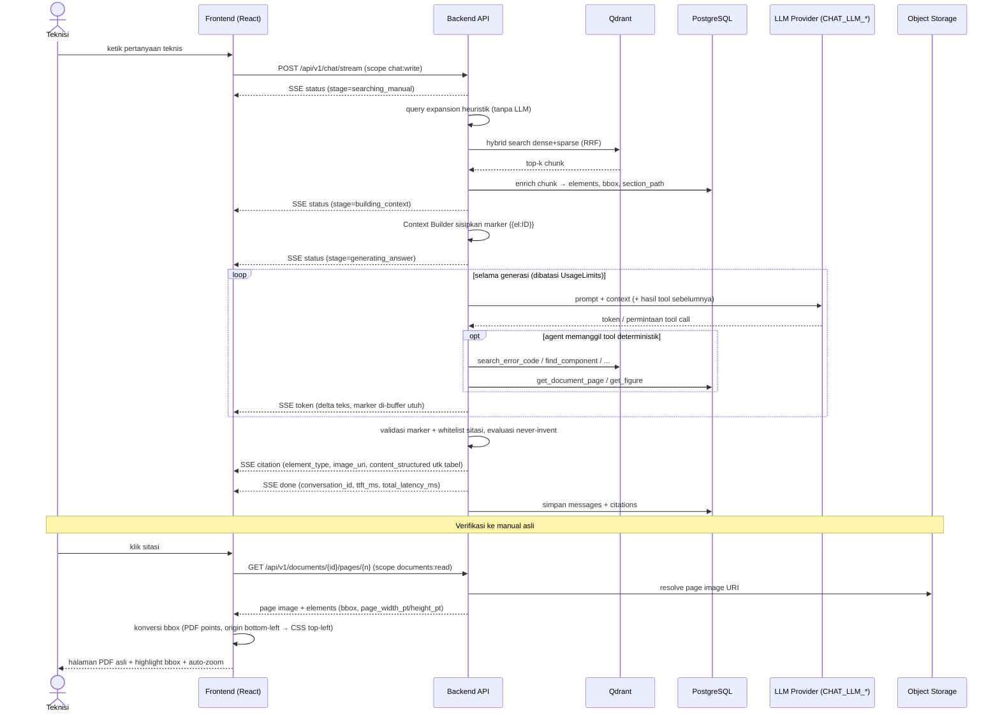
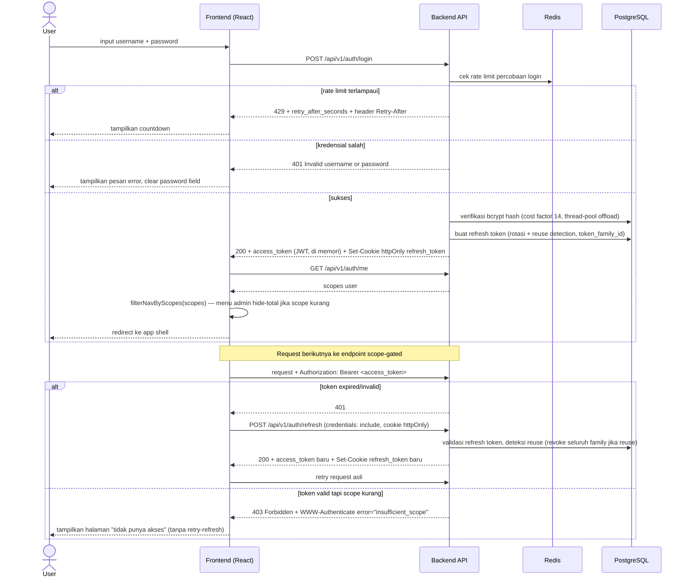
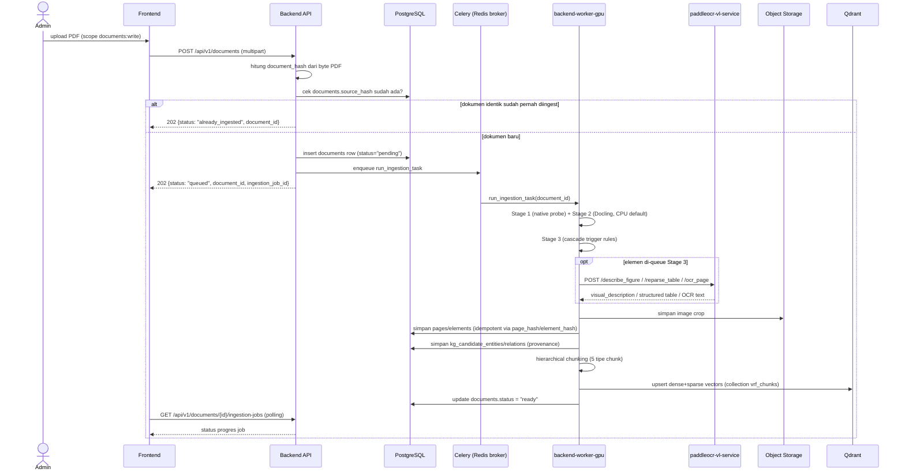

# VRF/VRV Technical Chatbot

Chatbot teknis berbasis RAG (Retrieval-Augmented Generation) untuk sistem
VRF/VRV (Variable Refrigerant Flow/Volume), dibangun di atas 7 dokumen
service manual PDF (±400 halaman masing-masing, ≈2.581 halaman total).
Chatbot menjawab pertanyaan troubleshooting, wiring, kode error, dan
prosedur servis dengan referensi yang bisa dilacak balik ke halaman &
dokumen sumber aslinya — termasuk elemen non-teks (skema elektrikal, tabel,
gambar display alat, ikon tombol inline, flow diagram).

> README ini adalah ringkasan orientasi untuk siapapun yang baru masuk ke
> repo ini. Dokumen desain rinci (arsitektur, roadmap, laporan QA, desain
> UI/UX) disimpan terpisah di luar repo ini dan tidak ikut di-commit.

## Status Proyek

| Fase | Cakupan | Status |
|---|---|---|
| **Fase 0 — Foundation** | Scaffold FE/BE, abstraksi provider (LLM/object storage/DB/vector store) via `.env`, skema data inti, Docker/WSL, Authentication & RBAC | ✅ Selesai |
| **Fase 1 — Ingestion Pipeline** | PDF → canonical representation (Docling + PaddleOCR-VL cascade) → chunking → embedding (Qdrant) | ✅ Selesai |
| **KG Foundation — Wave 1** | Ekstraksi kandidat entity/relasi KG: perbaikan presisi aturan, kunci kanonik, sinyal confidence, graf struktur dokumen, vocabulary lintas-vendor | ✅ Selesai |
| **Fase 2 — Chat Core** | Hybrid retrieval, Pydantic AI agent + tools, chat streaming (SSE), citation viewer | 🔄 Berjalan |
| **Fase 3 — Evaluation & Admin** | Dashboard evaluasi retrieval/generation, Manual Review Queue, halaman RBAC | ⏳ Belum dimulai |

Bukti nyata pipeline ingestion sudah berjalan end-to-end: 1 dokumen penuh
(*Zeggo VRV IV Service Manual REYQ*, 286 halaman) berhasil diproses —
2.916 elements, 1.417 chunk terstruktur, seluruhnya ter-embed (dense+sparse)
di Qdrant.

## Arsitektur Sistem



**Prinsip desain kunci:**
- **Plug-n-play provider** — LLM (Anthropic/Gemini/OpenAI/Local), object
  storage (MinIO/S3/local), database engine (Postgres/MySQL), dan vector
  store (Qdrant default, Chroma/Milvus opsional) semuanya dikonfigurasi
  murni lewat `.env`, tanpa ubah kode.
- **PaddleOCR-VL sebagai service terpisah** — awalnya direncanakan satu
  proses dengan Docling, tapi PyTorch (Docling) dan PaddlePaddle-GPU
  (PaddleOCR-VL) punya konflik ABI CUDA/NCCL yang tidak bisa hidup di venv
  yang sama. `backend-worker-gpu` (Docling) dan `paddleocr-vl-service`
  berjalan sebagai container terpisah, saling komunikasi lewat HTTP
  (`PADDLE_OCR_VL_BACKEND=remote_api`, bahkan untuk dev lokal).
- **`DOCLING_DEVICE` default `cpu`** — GPU RTX 3060 di lingkungan dev
  hanya 6GB VRAM; `paddleocr-vl-service` sendiri sudah memakai ~5.9-6GB
  saat inferensi, sehingga tidak ada ruang aman untuk Docling ikut memakai
  GPU secara bersamaan. Docling GPU hanya memberi speedup ~1.4x (bukan
  3-10x seperti estimasi awal), jadi trade-off ini diterima demi keamanan
  VRAM.

## Pipeline Ingestion (Fase 1)



**Idempotency**: setiap tahap dikunci `document_hash`/`page_hash`/
`element_hash` — re-ingest PDF yang identik akan di-skip total di level
trigger (`created=False`), re-run manual untuk 1 dokumen yang sudah ada
akan skip penulisan DB per-halaman yang hash-nya cocok (Docling/PaddleOCR-VL
tetap dijalankan ulang, hanya insert/update DB yang dihindari).

**Requirement kritis yang dijaga pipeline ini**: ikon/tombol inline tetap
terasosiasi ke kalimat induknya (termasuk kasus lintas halaman), struktur
tabel tetap ter-query (bukan flatten jadi teks acak, termasuk hasil
PaddleOCR-VL yang formatnya HTML bukan markdown), dan traceability penuh
`chunk → element → page → document`.

## Ekstraksi Kandidat Knowledge Graph

Kandidat entity/relasi KG diekstrak **secara deterministik** (regex +
dictionary domain), **bukan** lewat LLM — konsisten dengan prinsip
"deterministic tools, not model judgment" yang dipakai di sisi ingestion.
Kandidat disimpan sebagai `jsonb` di kolom `elements.kg_candidate_entities`
/ `kg_candidate_relations`, dan **belum dimuat ke Neo4j** (itu fase
berikutnya).



**Graf struktur dokumen** dibangun terpisah dan **tidak butuh ekstraksi
kandidat sama sekali** — murni diturunkan dari output Docling
(`Document → Page → Section → Element`, plus hierarki heading), sehingga
deterministik dengan presisi 100% dan hasilnya identik saat diulang.

**Re-extraction tanpa re-ingest**: karena kandidat KG hanya bergantung pada
`elements` yang sudah tersimpan, strategi ekstraksi bisa diubah kapan saja
dan dijalankan ulang lewat modul re-extractor — **≈6 detik per dokumen
286 halaman**, dibanding ~82 menit kalau harus re-ingest Stage 1–4. Ini yang
membuat penyempurnaan strategi KG murah untuk ditunda.

## Fase 2 — Logic Flow Chat

Prinsip utamanya: **agent hanya meng-orkestrasi, tools yang deterministik.**
Agent tidak memutuskan "bagaimana cara mencari" — tiap tool punya signature
eksplisit dan perilaku yang dapat diprediksi.



**Kenapa ada gerbang validasi deterministik?** LLM bisa mengarang
`element_id` — dan sitasi palsu di domain HVAC lebih berbahaya daripada
menolak menjawab, karena teknisi akan membuka manual di halaman yang salah.
Karena itu marker maupun sitasi **selalu** divalidasi balik terhadap konteks
yang benar-benar diretrieve, dan aturan "never invent" dievaluasi terhadap
sitasi **tervalidasi**, bukan output mentah LLM.

**Anggaran TTFT (< 30 detik)**: retrieval + context building dijaga di bawah
~3 detik (query expansion <1 ms, hybrid search ~15–440 ms), sisanya milik
LLM. Karena itu query expansion sengaja heuristik, bukan LLM call sinkron.

## Fase 2 — Sequence Flow Chat & Citation Viewer



## Sequence Flow: Autentikasi & Otorisasi



## Sequence Flow: Trigger Ingestion Dokumen



## Struktur Repo

```
vrf-chat/
├── backend/                        # FastAPI + Celery, Python (uv)
│   ├── app/
│   │   ├── agent/                  # Pydantic AI agent (Fase 2)
│   │   ├── api/v1/                 # auth, admin_rbac, documents, health, internal_storage
│   │   ├── auth/                   # JWT, refresh token rotation, RBAC scopes
│   │   ├── core/                   # config (Settings), observability
│   │   ├── db/                     # SQLAlchemy models, session/engine factory
│   │   ├── domain/                 # kamus istilah VRF/VRV
│   │   ├── evaluation/             # metrik retrieval/generation (Fase 3)
│   │   ├── ingestion/              # native_probe, docling_parser, cascade_trigger,
│   │   │                           #   paddleocr_vl_cascade, canonical_store, chunker,
│   │   │                           #   kg_candidate_extractor, embedder, orchestrator
│   │   ├── knowledge_graph/        # stub (Fase Later — Neo4j)
│   │   ├── llm_providers/          # factory Anthropic/Gemini/OpenAI/Local
│   │   ├── retrieval/              # VectorStoreClient (Qdrant)
│   │   ├── storage/                # ObjectStorageClient (MinIO/S3/local)
│   │   └── workers/                # Celery task definitions
│   ├── paddleocr-vl-service/       # service terisolasi (venv & Dockerfile sendiri)
│   ├── alembic/                    # migrations (termasuk seed data roles/scopes)
│   └── tests/{unit,integration}/
├── frontend/                       # React + Vite
│   └── src/{auth,components,hooks,lib,pages,routes,shell,styles}/
└── docker-compose.yml              # backend-api, backend-worker, backend-worker-gpu,
                                     #   paddleocr-vl-service, redis, postgres, qdrant,
                                     #   minio, neo4j (profile "kg", tidak default), frontend
```

## API Endpoint (Terimplementasi)

| Method | Path | Scope | Keterangan |
|---|---|---|---|
| `GET` | `/api/v1/health` | — | Health check |
| `POST` | `/api/v1/auth/login` | — | Login, rate-limited |
| `POST` | `/api/v1/auth/refresh` | — | Refresh access token (cookie httpOnly) |
| `POST` | `/api/v1/auth/logout` | — | Revoke refresh token |
| `GET` | `/api/v1/auth/me` | — | Info user + scopes |
| `GET`/`PUT` | `/api/v1/admin/rbac/roles/{id}/scopes` | `admin:rbac:read`/`write` | Permission Management |
| `GET`/`POST`/`PATCH` | `/api/v1/admin/rbac/users` | `admin:rbac:read`/`write` | User Management |
| `POST` | `/api/v1/documents` | `documents:write` | Trigger ingestion (multipart upload) |
| `GET` | `/api/v1/documents/{id}/ingestion-jobs` | `documents:write` | Status job ingestion |

> Endpoint Fase 2 (`/chat`, `/chat/stream`, `/conversations`, `/elements/{id}`,
> `/documents/{id}/pages/{n}`) yang muncul di diagram alur di atas **belum
> ada di branch utama** — masih dalam pengerjaan Fase 2. Tabel ini hanya
> memuat endpoint yang sudah benar-benar ter-merge.

## Menjalankan Secara Lokal

> **Docker hanya boleh dijalankan dari WSL**, tidak pernah dari Windows
> native — GPU passthrough (RTX 3060) hanya tersedia lewat WSL2 di
> environment pengembangan proyek ini.

```bash
# dari shell WSL, di dalam vrf-chat/
docker compose up -d                        # service inti (tanpa GPU worker/neo4j)
docker compose --profile gpu up -d          # + backend-worker-gpu, paddleocr-vl-service
docker compose --profile kg up -d neo4j     # opsional, Fase Later

# migrasi database (sekali di awal, atau setelah migration baru)
docker compose exec backend-api uv run alembic upgrade head
```

Backend: `cd backend && uv sync && uv run uvicorn app.main:app --reload`
Frontend: `cd frontend && npm ci && npm run dev`

Konfigurasi provider (LLM/object storage/DB/vector store) lewat
`backend/.env` — lihat `backend/.env.example` untuk daftar variabel lengkap
per provider, termasuk nilai yang valid untuk tiap `*_PROVIDER`.
